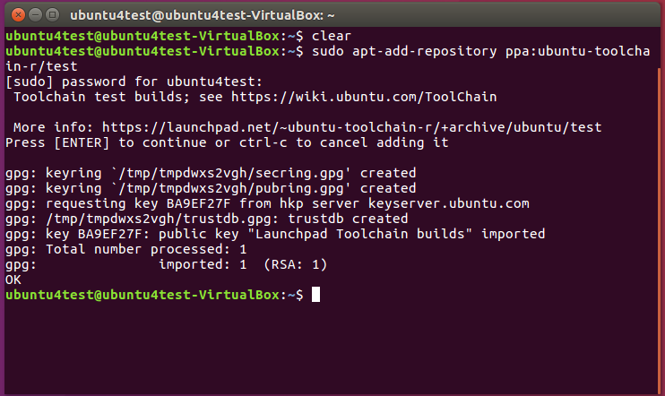
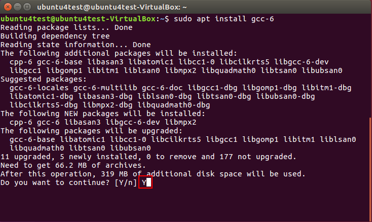
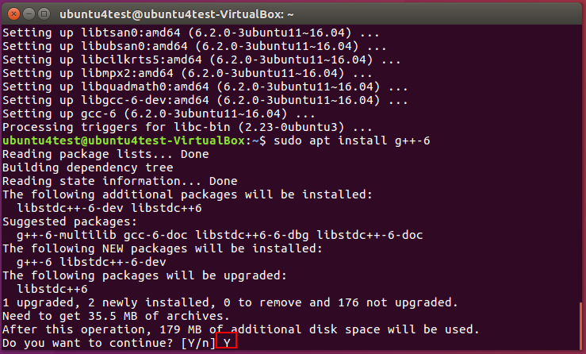
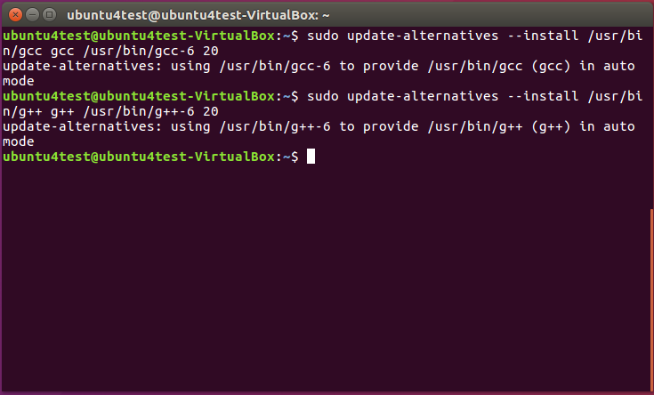
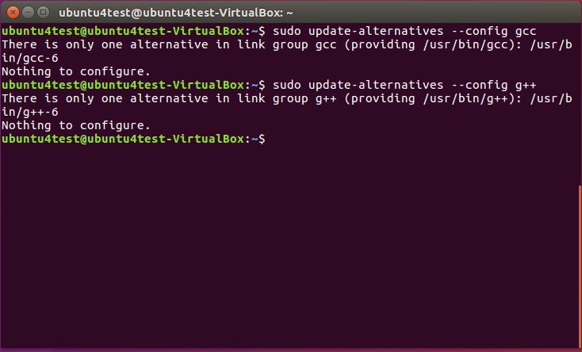

## This is a tips for update gcc/g++ to newer version(6.2) in ubuntu 16.04
The steps go as  
1. add the repository
```
  sudo apt-add-repository ppa:ubuntu-toolchain-r/test
```
  
2. install gcc 6
```
  sudo apt install gcc-6
```
  
3. install g++ 6
```
  sudo apt install g++-6
```
  
4. update the corresponding alternative commands for default gcc and g++
```
  sudo update-alternatives --install /usr/bin/gcc gcc /usr/bin/gcc-6 20
  sudo update-alternatives --install /usr/bin/g++ g++ /usr/bin/g++-6 20
```
  
5. update the configuration for gcc and g++ in case of multiple configure for gcc or g++
```
  sudo update-alternatives --config gcc
  sudo update-alternatives --config g++
```
  
-------
**Done**
