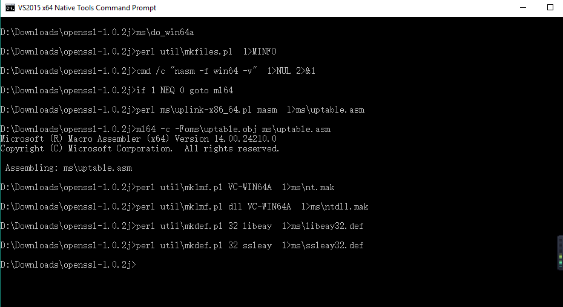

# OpenSSL Compilation for Windows x64
## 本教程主要讲解OpenSSL在windows的编译产生相应的库文件
1. 下载[ActivePerl](http://www.activestate.com/activeperl/downloads)[本示例的版本为ActivePerl 5.24.0 for Windows(64-bit, x64)],并安装到指定目录[本示例为"C:\Program File\Perl64"]
2. 测试ActivePerl的安装情况
	* Win+R调出命令行运行窗口，运行cmd命令  
		  
	* 转到ActivePerl安装目录中的eg目录：
		```
			cd /d C:\Program Files\Perl64\eg
		```
		  
	* 测试example
		```
			perl example.p1
		```
		  
	若显示“Hello from ActivePerl!”，则说明Perl安装成功，可以开始使用Perl的相关命令来进行OpenSSL的安装  
3. 下载[OpenSSL的源码包](https://www.openssl.org/source/openssl-1.0.2j.tar.gz)[本示例用的是openssl-1.0.2j.tar.gz]，解压到某个目录[本示例解压到D:\Downloads]  
	  
4. 编译OpenSSL库
	4.1 搜索找到VS 2015 X64 本地工具命令提示，点击打开“VS 2015 X64 本地工具命令提示”如下  
		  
		  
	4.2 转到OpenSSL的解压目录
		```
			cd /d D:\Downloads\openssl-1.0.2j
		```
		  
	4.3 调用Perl命令配置编译参数
		```
			perl Configure VC-WIN64A
		```
		  
	4.4 进一步配置，运行
		```
			ms\do_win64a
		```
		  
	4.5 运行
		```
			"C:\Program Files (x86)\Microsoft Visual Studio 14.0\VC\bin\amd64\nmake.exe" -f ms\ntdll.mak
		```
		需要等待许久= =	  
		如果编译成功，命令行最后几行如下  
			  
		最后的输出都在out32dll目录下  
			  
	4.6 转到输出目录进行编译结果测试
		```
			cd out32dll
			..\ms\test
		```
		测试结果如  
			  
	

		
	

	